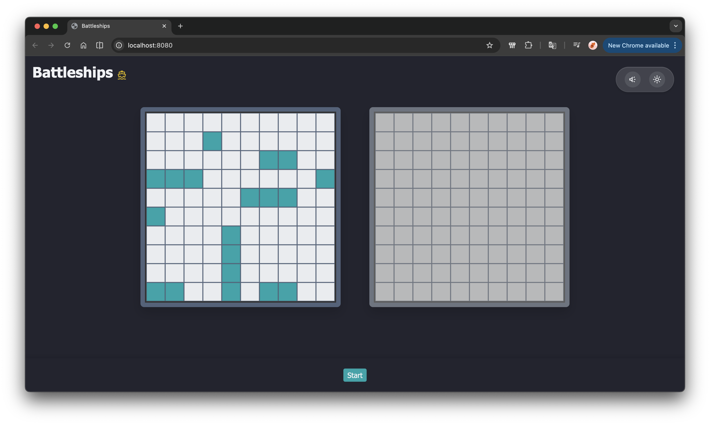
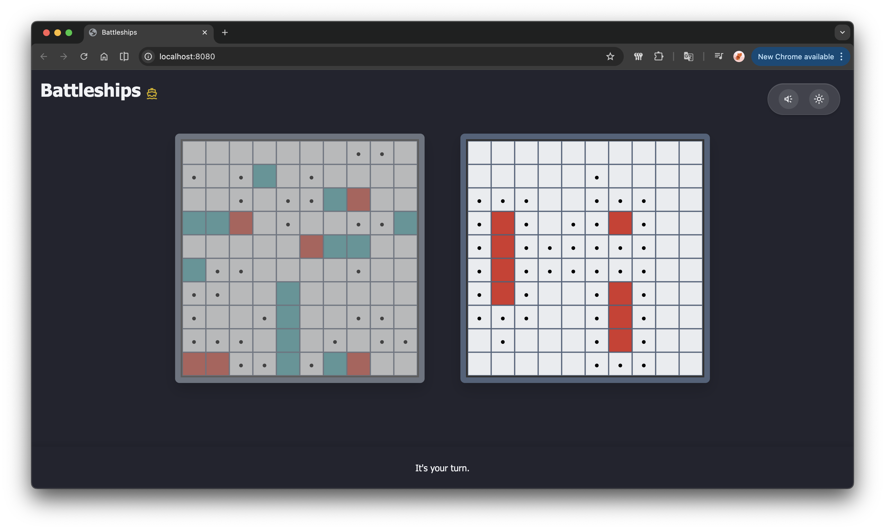

# ⚓ Battleships

A modern, responsive, and interactive Battleships game built with Vanilla JavaScript and SCSS. Test your tactical skills against an AI opponent in this variation of the [classical Battleship game](https://en.wikipedia.org/wiki/Battleship_(game)#:~:text=In%202002%2C%20Hasbro%20renamed%20the,Size).

## ✨ Features

- **Strategic Gameplay:** Classic 10x10 grid combat with intuitive ship placement.
- **Modern UI:** Responsive layout with smooth animations and nice hover effects.
- **Theme Support:** Fully integrated Light and Dark modes.
- **Dynamic Feedback:** Visual indicators for hits, misses, and sunken ships.
- **Smart Boarding:** Automatic marking of surrounding areas once a ship is confirmed sunk.

## 📸 Screenshots

| Ship Placement | In-Game Action |
| :---: | :---: |
|  |  |
| *Alforitm for random placement of ships* | *Game process - buffer zones around ships automatically fill up* |

## 🚀 Getting Started

### Prerequisites

- Node.js (v14 or higher)
- npm (v6 or higher)

### Installation

1. Clone the repository:
   ```bash
   git clone https://github.com/yourusername/battleships.git
   cd battleships
   ```

2. Install dependencies:
   ```bash
   npm install
   ```

### Development

Run the development server with Hot Module Replacement:
```bash
npm run serve
```

### Production Build

Create an optimized bundle in the `dist/` folder:
```bash
npm run build
```

## 🛠️ Built With

- **JavaScript (ES6+)** - Core logic and game state management.
- **Sass (SCSS)** - Advanced styling and theme management.
- **Webpack** - Module bundling and asset optimization.
- **Jest** - Comprehensive unit testing for game mechanics.
- **Babel** - JavaScript transpilation for cross-browser compatibility.

## 🧪 Testing

The project uses Jest for automated testing of the `Ship` and `Gameboard` classes.
```bash
npm test
```
